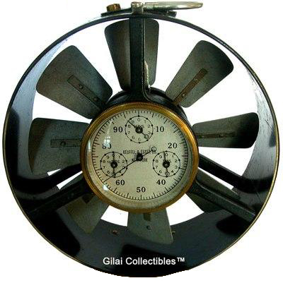

## Theory

There are few heat stress indices found in the literature to assess the climatic condition of an working environment such as: Dry bulb temperature and Wet bulb temperature, Effective temperature, Air cooling power measured by Kata thermometer, wet bulb globe temperature, specific cooling power etc. In fact, sometimes wet bulb temperature alone is used as a heat stress indicator to assess the climatic condition.

The cooling power of any mine air depends mainly on the wet bulb temperature (TW) and the air velocity (v). The dry-bulb temperature (TD) affects the cooling power only a little, except in cases of high dry bulb temperature coupled with low wet bulb temperature and high air velocity. So, the cooling power of mine air on the human body can be expressed in terms of wet bulb temperature and air velocity (Misra, 1985). The Kata thermometer is developed in early 1916 and used to estimate cooling power of air. A design aspect of Kata thermometer taken from Misra (1985) is given below

Figure 1: Kata thermometer

Kata thermometer (Figure 1) is a glass thermometer with a bulb of 40mm long and 20mm diameter filled with colored alcohol connected to a 200mm long stem having two smaller bulbs or reservoirs at the top and at the bottom ends. The stem has two marks one at 35° and another at 38°. When taking a reading with the Kata thermometer, the bulb is first heated by dipping it in hot water so the alcohol rises to the top reservoir. The bulb is then taken out of water and wiped with a dry cloth and is allowed to cool in the air. The time taken by thermometer to cool from 38° to 35° is noted. The Kata cooling factor which gives the amount of heat loss per cm2 from the surface of the bulb in cooling from 38° to 35° is usually written on the Kata thermometer. This factor divided by the time taken for the cooling gives the estimate of Kata cooling power of air.

Kata thermometer can be used to estimate dry Kata cooling power as well as wet Kata cooling power. However, the dry-Kata reading gives an estimate of the heat loss from the surface of the bulb due to radiation, convection and hence it is of little importance, particularly under hot and humid conditions where most of the heat loss from the human body is through evaporation. So, the wet Kata cooling power is mostly used in practical cases. The wet Kata reading is obtained by covering the bulb of the Kata thermometer by wet muslin. The idea is to make it resemble the human body which loses heat by radiation, convection and evaporation.

The Wet Kata cooling power (K) is seen to be related with the wet-bulb temperature (TW) and the air velocity (v). An empirical relationship between Kata cooling power with the wet bulb temperature and air velocity is cited in the mine ventilation book of Misra (1985). This empirical relationship is given below:

$$ K=(14.65 + 35.59 * v ^{\frac{1}{3}})(309.65 -T_w); For v < 1ms^-1 $$

$$ K=(4.95 + 46.05 * v ^{\frac{1}{3}})(309.65 -T_w); For v > 1ms^-1 $$

A moderately working man usually produces about 165Wm−2 of waste heat which has to be dissipated. In other words, a Kata value of 165Wm−2 should be sufficient for cooling a moderate worker, but it has been found that the rate of cooling of Kata thermometer is much faster compared to human body, i.e. the cooling air is not 100% efficient for the human body as compared to Kata thermometer. This is due to the fact that the Kata thermometer is much smaller compared to human body and has a smaller volume to surface area ratio. Also, the convection co-efficient of Kata thermometer is twice than that of human body. The body surface is rarely completely sweat covered as the wet Kata thermometer. Because of the clothing, air cannot get access to the whole body surface. Besides, the factor of acclimatization of human too contributes to the difference between the cooling effect of mine air on the Kata thermometer and the human body. From several book, it has been seen that Kata cooling efficiency of air at only 20% which means that for comfortable working, the minimum wet-Kata cooling power reading should be 165*5=825 Wm−2.

This experiment is designed to evaluate Kata cooling power of air in certain environment and also to examine the variation of cooling power with the change of air velocity.

Design and operating principle of Vane anemometer used in the experiment is elaborated below

#### One minute vane anemometer

Fig: One minute vane anemometer

A one minute vane anemometer consists of a small windmill with vanes set an angle of 0.785 radians to the direction of air flow which rotates the vanes at a speed proportional to the air velocity. The no. of revolutions converted to a scale of distance traversed by the air recorded in set of counting dials operated through gears. The air velocity can be obtained by dividing this reading by the duration of one minute. The commonly used anemometer is the Biram type which is 100-112 mm in diameter with centrally placed counting dials. There is small clutch which can be operated to engage the wheel with the counting system while measuring the air velocity. A resetting device brings back the reading to zero. Provision can be made for mounting the anemometer on a shaft for more accurate measurements away from the body. In such cases, arrangements are made to operate the clutch from a distance by means of a metal rod.

## Instruments Used:
- Kata thermometer
- Stopwatch
- Assmann Psychrometer
- Vane anemometer
- Thermo flux containing hot water
- Distilled water

## How it works

Take the Askania Minimeter readings and the Inclined Tube manometer readings.

Take the wet bulb temperature from the Assaman Psychrometer and note the time of fall down of thermometer alcohol 38°C to 35°C and measure the air velocity by the Anemometer.

Control the air flow by the flow control device and measure the Wet Kata Cooling Power by the equation H = (F / S). Where F is Kata factor and S is Time Period in seconds.

Then Calculate the WKCP by the given equation:

$$ K=(14.65 + 35.59 * v ^{\frac{1}{3}})(309.65 -T_w); For v < 1ms^-1 $$

$$ K=(4.95 + 46.05 * v ^{\frac{1}{3}})(309.65 -T_w); For v > 1ms^-1 $$

Here v is velocity of air flow. TW is the wet bulb temperature.

## Demo

<!-- blank line -->
<figure class="video_container">
  <iframe src="https://www.youtube.com/embed/4pJjNwj6Cis" frameborder="0" allowfullscreen="true"> </iframe>
</figure>
<!-- blank line --> 

